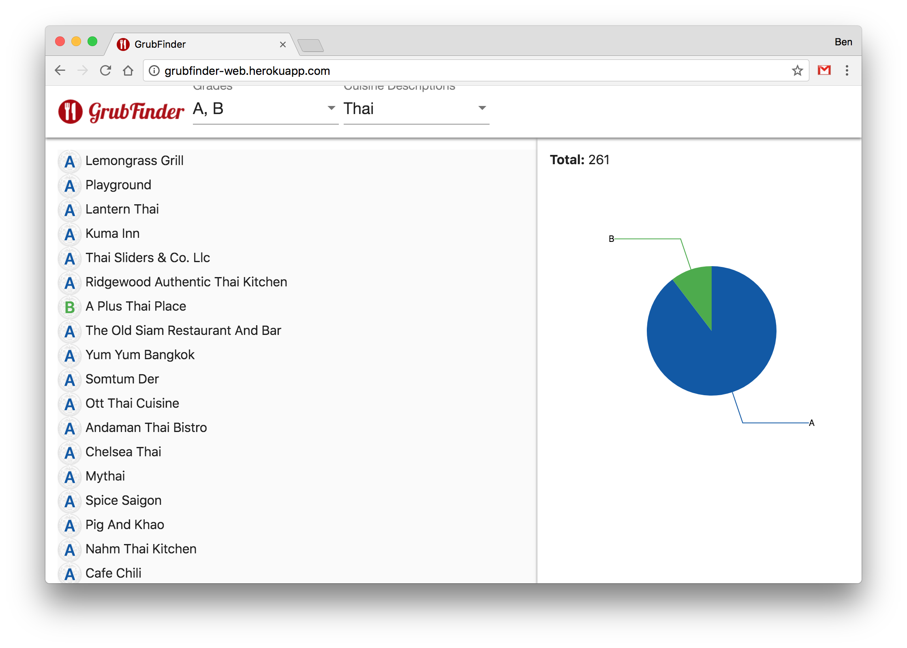

# grubfinder-client
[](src/assets/logo.png)

This is a client for the GrubFinder application, whose purpose is to aggregate all grading and reporting for New York 
City restaurants and to display them in a digestible (heh) way. You can find the corresponding `grubfinder-server` code
[over here](https://github.com/benburton/grubfinder-server).

[](screenshot.png)

You can view a live deployment at [http://grubfinder-web.herokuapp.com/](http://grubfinder-web.herokuapp.com/) (a little slow, as it's on a free dyno).

## Features
- Dropdowns to select multiple grades (most recent) as well as cuisine descriptions.
- A live pie chart in the right panel shows the breakdown of different ratings across the current query.
- Infinite scroll loads query results in batches of 50.
- Hovering grades in search results list on the left displays their inspection date in a tooltip.
- Clicking a restaurant from the list displays its name, most recent grade in the sidebar.
- All currently available inspections are displayed underneath the restaurant's name/current grade in the sidebar.
- Inspection reports include violation codes, display violation code descriptions in tooltip on hover.

## Development

### Dependencies

You will need the following dependencies installed in order to run the application locally:

- [Node.js](https://nodejs.org/)
- [angular-cli](https://github.com/angular/angular-cli) ```npm install -g @angular/cli```

### Installation

Run the `npm` install target:

```
npm install
```

### Local Development

```
ng serve
```

to run the project, and navigate to [http://localhost:4200](http://localhost:4200) (if you run `ng serve --open` a browser will open for you automatically). Hot-reloading is enabled in development by default.

### Running Tests

```
ng test
```

runs the unit tests

## Deployment

This project is configured to run on [Heroku](https://www.heroku.com/).

### Dependencies

- [Heroku CLI](https://devcenter.heroku.com/articles/heroku-cli)

### Git Setup

Run 

```
heroku create
```

to generate a new Heroku application. This will also add the `heroku` git remote repository to your configuration:

```
$ git remote -v
heroku	https://git.heroku.com/grubfinder-web.git (fetch)
heroku	https://git.heroku.com/grubfinder-web.git (push)
origin	git@github.com:benburton/grubfinder-client.git (fetch)
origin	git@github.com:benburton/grubfinder-client.git (push)
```

### Push

You should simply be able to run

```
git push heroku master
```

for a working deployment to your Heroku application (note that when pushing to Heroku your app will default to targeting the "production" `http://grubfinder-api.herokuapp.com/` endpoint).

## TODOs

### Testing
- Finish unit test coverage
- Introduce end to end tests
- Integrate with TravisCI

### Feature Improvements
- Better data visualization of high-level query stats (user interface is imperfect)
- Add geocoded data to display Google Maps/address as part of restaurant information
- Add a clearer loading state to components whose data loads asynchronously

